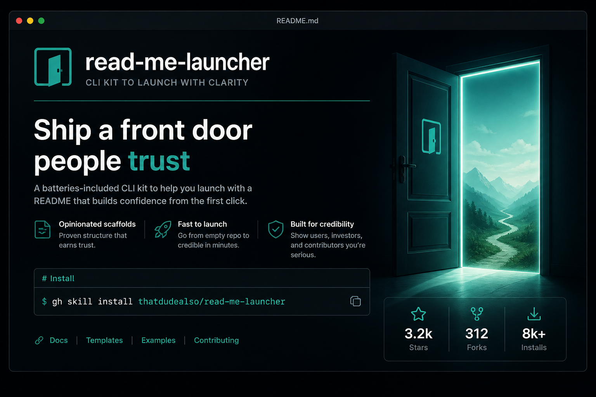
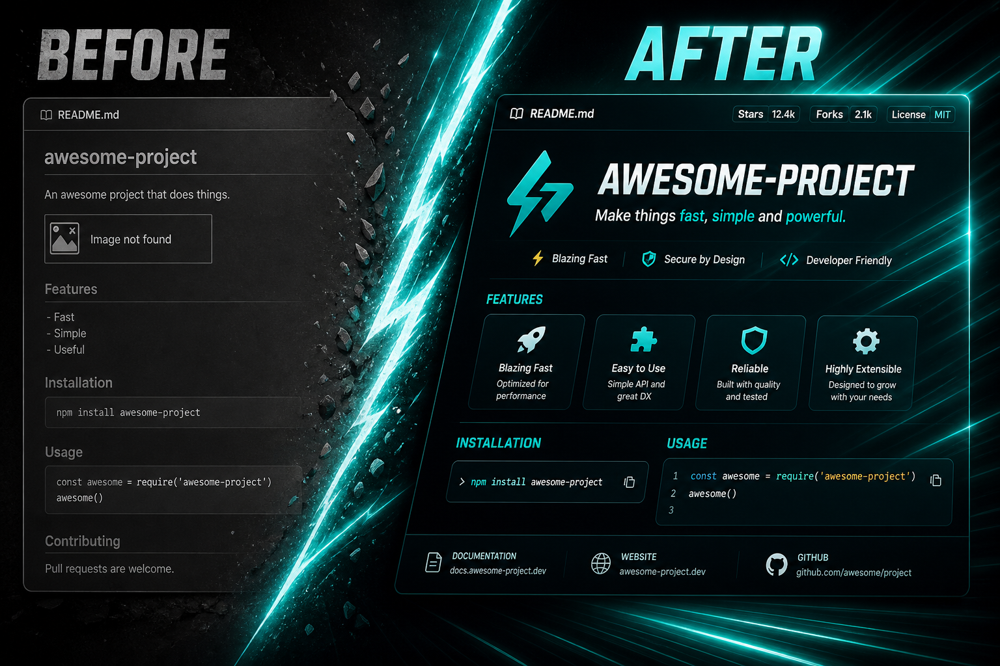

<div align="center">

  

  <p><strong>Audience-aware, repository-grounded README generation for agents.</strong><br />
  Inspect first. Match install/run claims to the real repo. Choose the minimum honest proof. Lint render breaks and common secret patterns.</p>

  <p>
    <a href="https://github.com/thatdudealso/read-me-launcher/releases"></a>
    <a href="LICENSE"></a>
    <a href="https://agentskills.io"></a>
  </p>

</div>

## Install

**Manual (works everywhere skills load):**

```bash
git clone https://github.com/thatdudealso/read-me-launcher.git
ln -sfn "$(pwd)/read-me-launcher/skills/read-me-launcher" ~/.cursor/skills/read-me-launcher
# also: ~/.claude/skills  ~/.codex/skills  ~/.agents/skills
```

**GitHub CLI (if you use `gh skill`):**

```bash
gh skill install thatdudealso/read-me-launcher
```

Pin a release when you want a fixed version:

```bash
gh skill install thatdudealso/read-me-launcher read-me-launcher --pin v1.5.3
```

## Example agent prompt

```text
Use read-me-launcher on this repo.
1) Run inspect-repo.sh
2) Classify interface / audience / primary proof
3) Rewrite README with verified install/run commands only
4) Use minimum proof (code unless visual proof is required)
5) Run check-readme.sh and fix errors
```

## What it actually does

| Step | Tooling |
|------|---------|
| Inspect manifests, scripts, visibility | `scripts/inspect-repo.sh` |
| Classify interface x audience x proof | `references/taxonomy.md` |
| Draft with evidence-first defaults | `SKILL.md` + references |
| Fail on nested fences, missing images, common secrets | `scripts/check-readme.sh` |

### Before -> after (text)

**Before (common drift):**

```markdown
## Run
npm start
```

(but the repo only defines `pnpm dev`)

**After (grounded):**

```markdown
## Run
pnpm dev
```

(verified from `package.json` scripts)

### Proof, not perfume

Public + shareable does **not** mean three PNGs. Pick the cheapest honest proof:

- Library -> working code sample
- CLI -> terminal / command proof
- GUI -> one real screenshot
- Agent skill -> install + prompt + lint/inspect behavior
- Internal -> purpose + runbook

## Secret pattern scanning

`check-readme.sh` **errors** on common credential shapes in README text, including GitHub PATs, AWS `AKIA…` keys, OpenAI-like `sk-…` keys (skips obvious fakes), Stripe live keys, Slack tokens, Bearer tokens, DB URLs with passwords, and PEM private key blocks.

This is pattern scanning, not a full secret-management product. Do not paste live `.env` contents into docs.

Lint levels:

- **ERROR** - broken render, missing image, possible secret
- **WARN** - fragile patterns
- **PREF** - style (em dashes); `--strict-style` to promote

```bash
./skills/read-me-launcher/scripts/check-readme.sh README.md
./skills/read-me-launcher/scripts/check-readme.sh README.md --strict-style
```

## Verify locally

```bash
./skills/read-me-launcher/tests/run-tests.sh
```

<div align="center">

  

</div>

<div align="center">

  

</div>

## Troubleshooting

| Symptom | Likely cause | Fix |
|---------|--------------|-----|
| Broken image icon | CSS-class SVG stripped by GitHub camo | Use PNG/WebP, or inline-attribute SVG |
| Raw fences showing in page | Fence nested inside a centered HTML block | Move fences outside HTML wrappers |
| `check-readme` fails on `sk-…` | Real-looking key in README | Use `sk-example-…` or document name only |
| Install command wrong | Invented from memory | Re-run `inspect-repo.sh` and copy real scripts |
| Skill not found by agent | Not on skill path | Use manual symlink into `~/.cursor/skills` etc. |

## Layout

```text
skills/read-me-launcher/
├── SKILL.md
├── assets/
├── scripts/
│   ├── inspect-repo.sh
│   └── check-readme.sh
├── references/
│   ├── taxonomy.md
│   ├── audience.md
│   ├── visuals.md
│   ├── generation.md
│   ├── design.md
│   ├── privacy.md
│   └── section-map.md
└── tests/
    ├── fixtures/
    └── run-tests.sh
```

## Pair with consistent-naming

```bash
gh skill install thatdudealso/consistent-naming
```

or symlink from https://github.com/thatdudealso/consistent-naming

Workflow: name with `consistent-naming`, document with `read-me-launcher` so the tree and the landing page agree.

## License

[MIT](LICENSE)
