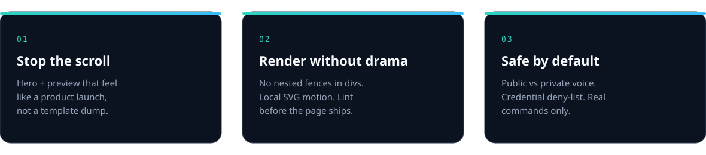

<div align="center">

  

  

  <p><strong>An Agent Skill that launches museum-quality GitHub READMEs.</strong><br />
  Hero craft. Truthful install paths. Credential deny-list. Render-safe Markdown.</p>

  <p>
    <a href="https://github.com/thatdudealso/read-me-launcher/releases"></a>
    <a href="LICENSE"></a>
    <a href="https://agentskills.io"></a>
  </p>

</div>

```bash
gh skill install thatdudealso/read-me-launcher
```

<div align="center">

  

</div>

<div align="center">

  

</div>

## Why this exists

Most READMEs die in the first screen: scaffold dumps, badge walls, invented claims, and broken Markdown that GitHub cannot render cleanly.

**read-me-launcher** forces a higher bar and a safer renderer.

| Without it | With it |
|---|---|
| Text-only “Getting Started” | Custom SVG hero + preview |
| Nested fences that break GitHub | Lint that blocks those footguns |
| Flaky external animated images | Local motion inside committed SVGs |
| Secrets and fake stack claims | Inspect-first + deny-list |

## Quick start

```bash
gh skill install thatdudealso/read-me-launcher
```

Pin a release:

```bash
gh skill install thatdudealso/read-me-launcher read-me-launcher --pin v1.2.0
```

Ask your agent:

```text
/read-me-launcher

Make this README feel like a product launch. Create local SVG assets.
Keep code fences outside HTML divs. Run check-readme.sh. No secrets.
```

### Manual install

```bash
git clone https://github.com/thatdudealso/read-me-launcher.git
ln -sfn "$(pwd)/read-me-launcher/skills/read-me-launcher" ~/.cursor/skills/read-me-launcher
```

Works the same for `~/.claude/skills`, `~/.codex/skills`, and `~/.agents/skills`.

## What the skill enforces

1. **Inspect** the real repo (`scripts/inspect-repo.sh`)
2. **Design** hero / preview / feature graphics first
3. **Write** a render-safe README (no fences inside centered divs)
4. **Lint** with `scripts/check-readme.sh`
5. **Scrub** credentials via the deny-list

This page is the skill applied to itself.

## Layout

```text
skills/read-me-launcher/
├── SKILL.md
├── assets/
│   ├── banner.svg
│   ├── tagline.svg
│   ├── preview.svg
│   └── features.svg
├── scripts/
│   ├── inspect-repo.sh
│   └── check-readme.sh
└── references/
    ├── design.md
    ├── visuals.md
    ├── privacy.md
    └── section-map.md
```

## Pair with consistent-naming

```bash
gh skill install thatdudealso/consistent-naming
gh skill install thatdudealso/read-me-launcher
```

Name with [`consistent-naming`](https://github.com/thatdudealso/consistent-naming). Launch the front door with this skill.

## License

[MIT](LICENSE)
